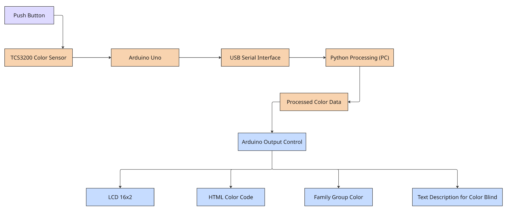
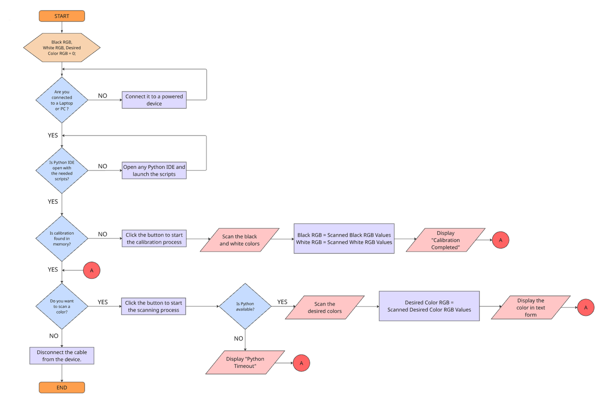
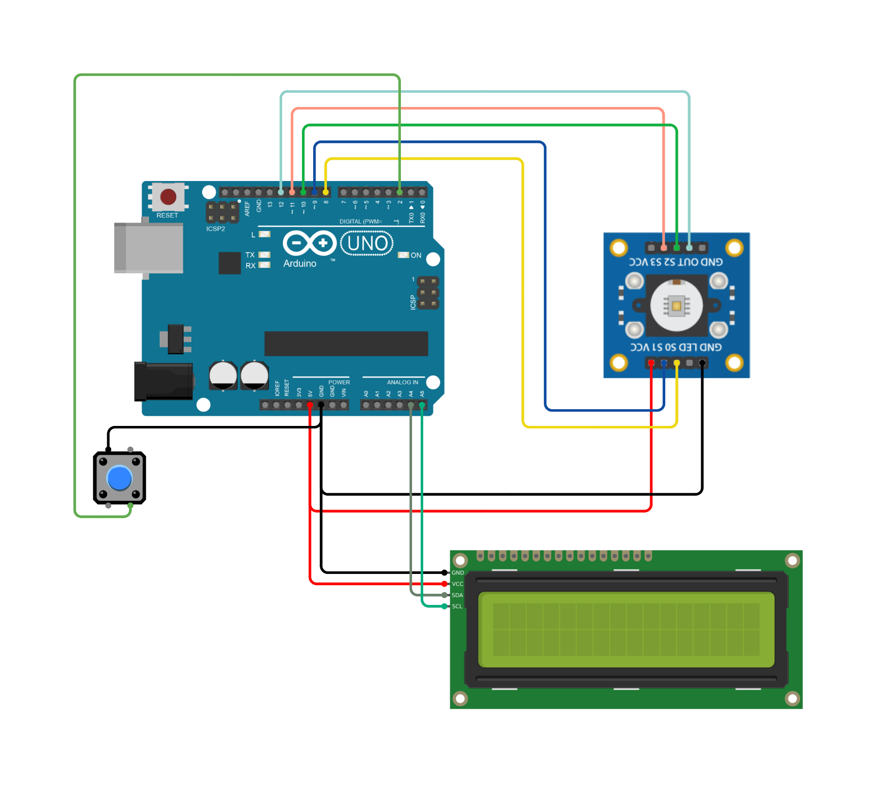

# Arduino-Based Real-Time Color Identification System

## 📌 Overview
This project is a calibrated embedded color recognition system that integrates Arduino-based sensor acquisition with Python-based classification and bidirectional serial communication.

It features real-time RGB normalization, nearest-color matching using Euclidean distance, and an accessibility-focused color description layer designed for color-blind users.

The system uses a state machine architecture to manage calibration, scanning, processing, and display phases.

---

## ⚙️ System Architecture

### Block Diagram


### Flowchart


### Circuit Diagram


---

## 🔧 Hardware Components
- Arduino Uno
- TCS3200 Color Sensor
- 16x2 LCD (I2C Module)
- Push Button (for input/control)
- Breadboard
- Jumper wires

---

## 💻 Software Tools
- Arduino IDE
- Python 3.x
- PySerial (for serial communication)
- LiquidCrystal_I2C library (Frank de Brabander)
- NumPy (optional for processing)
  
---

## 🚀 Key Features

- Real-time color detection using TCS3200 sensor
- Calibration system using black/white reference
- RGB normalization (0–255 scaling)
- Nearest HTML color matching (Euclidean distance)
- Bidirectional Arduino ↔ Python communication
- 16x2 LCD real-time display with scrolling text
- Color-blind friendly output descriptions

---

## 🔄 System Workflow

1. System calibrates using black and white reference values
2. User triggers scanning via push button
3. Arduino reads RGB sensor values
4. Arduino normalizes RGB (0–255 scale)
5. Data is sent to Python via serial communication
6. Python processes and classifies color
7. Python sends formatted result back to Arduino
8. Arduino displays output on 16x2 LCD
   
---

## 📊 Output Display Format

The system displays detected color information in the following format:

**Family Group | HTML Color | Color Description (for color-blind users)**

Examples:

Red Family | Crimson | Dark, strong

Green Family | Forest Green | Medium, soft

---

## 🔄 System Interaction (Architecture View)

Arduino ↔ Python communication forms a closed-loop embedded system.

- Arduino is responsible for hardware-level operations:
  sensor reading, calibration, LCD control, and state machine execution.

- Python is responsible for data-level intelligence:
  color classification, nearest-color matching, and descriptive mapping.

- Communication pipeline:
  Arduino → Python: raw RGB values  
  Python → Arduino: processed classification results

- LCD serves as the final output interface controlled by Arduino.
 
---

## ⚠️ Limitations

- **Lighting Sensitivity** – Accuracy depends on ambient lighting and shadows.
- **Surface Variability** – Different materials affect sensor readings.
- **Calibration Required** – Needs proper black/white calibration before use.
- **Color Accuracy Limits** – Nearest-color matching may not reflect exact human perception.
- **Serial Dependency** – Relies on Arduino ↔ Python communication, causing possible delays.
- **Not Standalone** – Requires a computer to run the Python processing script.
- **No Power Switch** – Operates via USB without a dedicated ON/OFF control.
- **LCD Constraints** – Limited display space requires scrolling.
- **Environmental Factors** – Performance may vary in uncontrolled conditions.

---

## 📂 Project Structure

```
arduino/
│── color_sensor.ino        # Arduino code for sensor data acquisition  

python/
│── color_processor.py      # Python script for processing and classification  

assets/
│── 01_block_diagram_system_overview.png  
│── 02_flowchart_color_detection_logic.png  
│── 03_circuit_diagram_tcs3200_arduino_uno.png  
